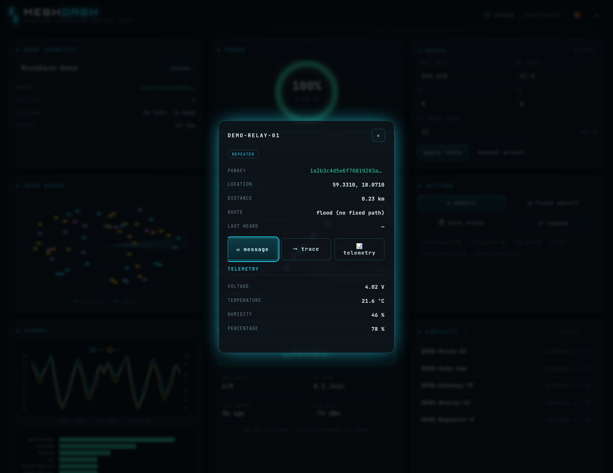
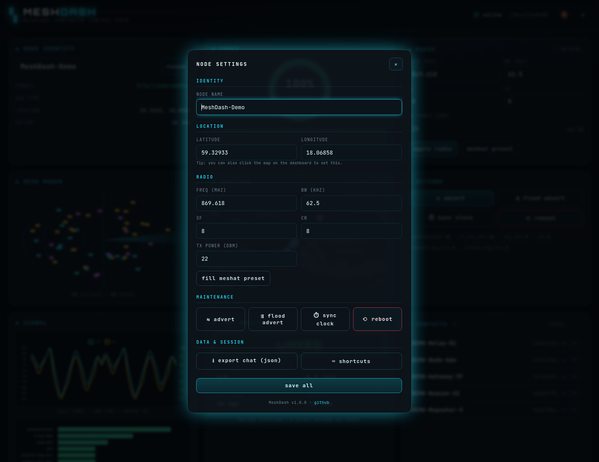
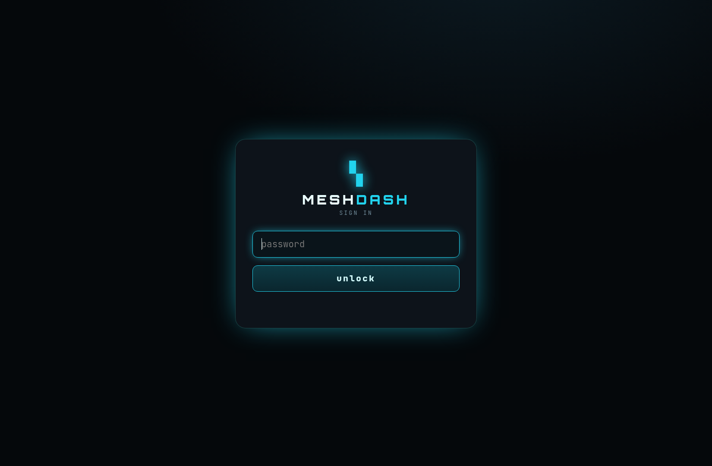

# MeshDash

A local web control deck for a **USB-connected [MeshCore](https://meshcore.co.uk/) companion node**
(tested on a Heltec WiFi LoRa 32 V4 running the USB Companion firmware).

It talks to the node over USB serial using the [`meshcore`](https://pypi.org/project/meshcore/)
Python library and serves a single-page dashboard with a live view of the mesh.


## Features

- **Live packet feed** — every event off the radio, colour-coded by type, with a filter.
- **Mesh radar** — animated sweep that blips on adverts / contacts / messages.
- **Battery gauge** + voltage history sparkline.
- **Radio config** — edit freq / bandwidth / SF / coding-rate / TX power, with an
  on-mesh vs. mismatch indicator and a one-click "meshat preset".
- **Signal charts** — RSSI / SNR history of recent receptions + a packets-by-type histogram.
- **Link health** — at-a-glance verdict (LINKED / RX OK / QUIET), ACK count, live RX
  rate, and time-since-last-heard. Note: only *online companion* nodes ACK, so a healthy
  node normally reads **RX OK** until you DM an active peer (it does **not** mean you're
  not being heard — broadcasts like adverts don't ACK).
- **Live mesh map** (Leaflet) — your node *and every neighbour* plotted with links; click
  the map to set your own position.
- **Relays** — the repeaters carrying multi-hop traffic *to* your node, with average hop
  count, resolved to node names (derived from received packet paths).
- **Chat** — a thread sidebar with **unread badges** covering the public channel,
  add/name **private channels** (optional secret passphrase), and **1-to-1 PMs** with
  **delivery ticks** (✓ sent → ✓✓ delivered, driven by mesh ACKs).
- **Traceroute** — discover and visualise the repeater hops to any contact (`⤳`).
- **Contacts & node detail** — auto-discovered neighbours (filterable); click one (or its
  map marker) for full detail — type, pubkey, distance, route, last-heard — with message,
  trace, and **telemetry** (request a neighbour's battery / temp / humidity) actions.
- **History & search** — chat persists across restarts (SQLite); full-text search over
  your whole message history; export to JSON.
- **Settings** — one consolidated dialog (identity, location, radio, TX, maintenance,
  channels) via styled modals throughout — no browser `prompt()`s.
- **Notifications & PWA** — opt-in desktop + sound alerts on new messages; **installable**
  (manifest + service worker) with an offline app shell and a standalone window.
- **Auth & shortcuts** — optional password login (`MESHDASH_PASSWORD`); keyboard shortcuts
  (`/` search · `s` settings · `c` channels · `n` notifications · `?` help); mobile-responsive.
- **Actions** — advert / flood advert, clock sync, reboot, rename.

## Screenshots

The full deck — battery & signal charts, mesh radar, live map, link-health, chat sidebar, and contacts:


| Messaging — delivery ticks, unread badges | Node detail + neighbour telemetry |
| :---: | :---: |
|  |  |
| **Consolidated settings** | **Traceroute** |
|  |  |

Optional password login:



## Architecture

- **Backend** (`app.py`): Flask (sync) + a background asyncio thread that owns **one**
  persistent `meshcore` serial connection. All device commands are serialised behind a
  lock so the request/response protocol never interleaves. The browser polls
  `/api/status` and `/api/events`.
- **Frontend** (`templates/` + `static/`): vanilla JS, no build step. Chart.js + Leaflet
  via CDN.

## Run

With [uv](https://docs.astral.sh/uv/) (recommended — reproducible from `uv.lock`):

```bash
uv run python app.py        # builds .venv on first run, serves http://127.0.0.1:8787
```

Or with pip:

```bash
pip install -r requirements.txt
python3 app.py
```

Set `PORT` (serial device, default `/dev/ttyACM0`) at the top of `app.py`; the web port
is `MESHDASH_PORT` (default `8787`).

### Demo mode (no hardware)

Preview the dashboard with synthetic data — no node required (this is how the screenshots
above were generated):

```bash
MESHDASH_DEMO=1 uv run python app.py
```

### Tests

```bash
uv run pytest
```

See [CHANGELOG.md](CHANGELOG.md) for the feature history.

## ⚠️ Security

By default the server is unauthenticated and binds to `0.0.0.0`. Gate it with an optional
password (adds a login page + signed session cookie):

```bash
MESHDASH_PASSWORD=yoursecret uv run python app.py
```

The password controls *access* but doesn't *encrypt* traffic — for anything beyond a
trusted LAN, put it behind HTTPS (e.g. a reverse proxy like Caddy/nginx).

## License

MIT
