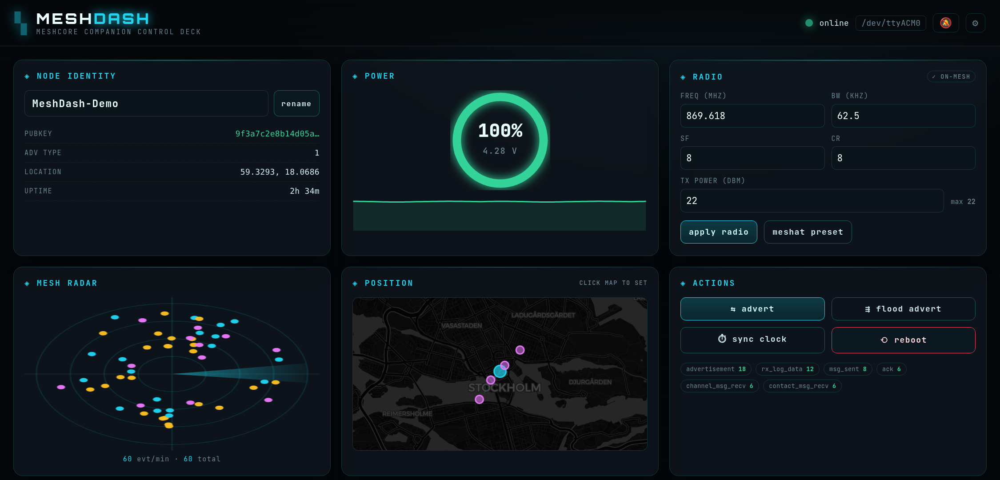
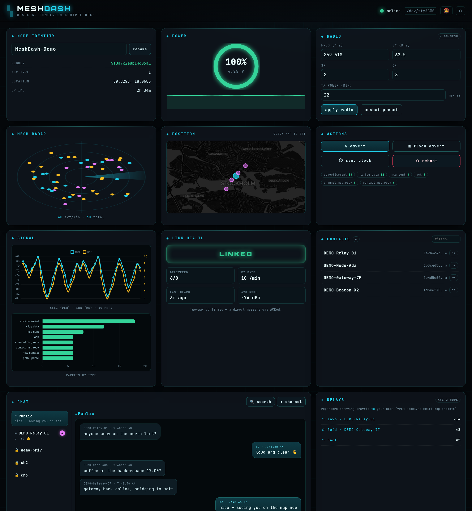
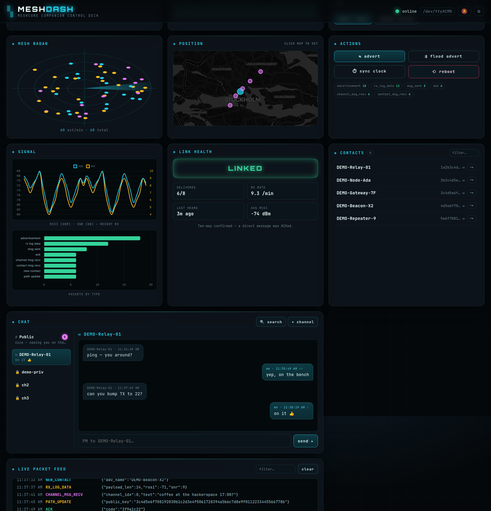
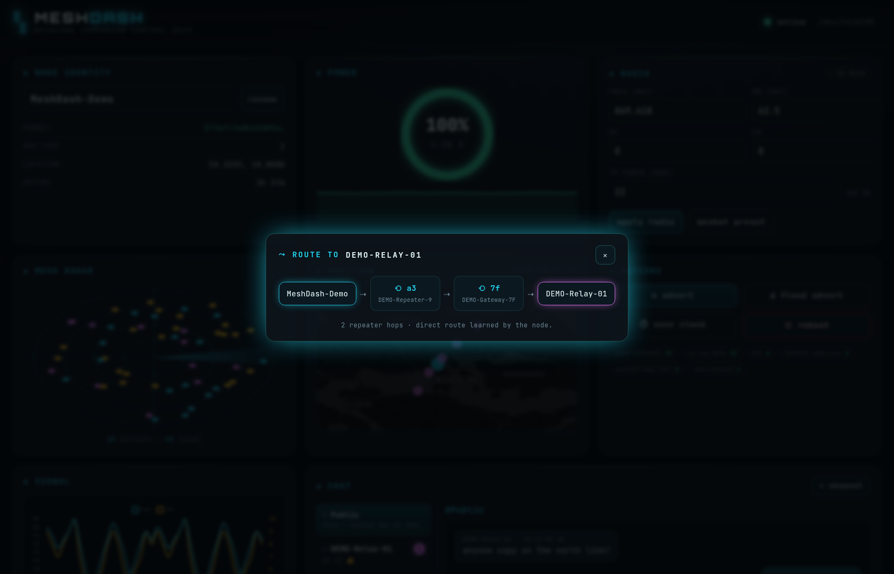

# MeshDash

A local web control deck for a **USB-connected [MeshCore](https://meshcore.co.uk/) companion node**
(tested on a Heltec WiFi LoRa 32 V4 running the USB Companion firmware).

It talks to the node over USB serial using the [`meshcore`](https://pypi.org/project/meshcore/)
Python library and serves a single-page dashboard with a live view of the mesh.



## Features

- **Live packet feed** — every event off the radio, colour-coded by type, with a filter.
- **Mesh radar** — animated sweep that blips on adverts / contacts / messages.
- **Battery gauge** + voltage history sparkline.
- **Radio config** — edit freq / bandwidth / SF / coding-rate / TX power, with an
  on-mesh vs. mismatch indicator and a one-click "meshat preset".
- **Signal charts** — RSSI / SNR history of recent receptions + a packets-by-type histogram.
- **Link health** — at-a-glance verdict (ISOLATED / RX-ONLY / LINKED), message delivery
  ratio, live RX rate, and time-since-last-heard — handy for finding a spot where your
  node is actually heard back.
- **Live mesh map** (Leaflet) — your node *and every neighbour* plotted with links; click
  the map to set your own position.
- **Chat** — a thread sidebar with **unread badges** covering the public channel,
  add/name **private channels** (optional secret passphrase), and **1-to-1 PMs** with
  **delivery ticks** (✓ sent → ✓✓ delivered, driven by mesh ACKs).
- **Traceroute** — discover and visualise the repeater hops to any contact (`⤳`).
- **Contacts** — auto-discovered neighbours; click one to open a PM.
- **Actions** — advert / flood advert, clock sync, reboot, rename.

## Screenshots

The full deck — live packet feed, signal charts, mesh map, chat sidebar, and contacts:



Direct messages with delivery ticks, plus the thread sidebar with unread badges:



Traceroute — the repeater hops from your node to a contact:



## Architecture

- **Backend** (`app.py`): Flask (sync) + a background asyncio thread that owns **one**
  persistent `meshcore` serial connection. All device commands are serialised behind a
  lock so the request/response protocol never interleaves. The browser polls
  `/api/status` and `/api/events`.
- **Frontend** (`templates/` + `static/`): vanilla JS, no build step. Chart.js + Leaflet
  via CDN.

## Run

With [uv](https://docs.astral.sh/uv/) (recommended — reproducible from `uv.lock`):

```bash
uv run python app.py        # builds .venv on first run, serves http://127.0.0.1:8787
```

Or with pip:

```bash
pip install -r requirements.txt
python3 app.py
```

Set `PORT` (serial device, default `/dev/ttyACM0`) at the top of `app.py`; the web port
is `MESHDASH_PORT` (default `8787`).

### Demo mode (no hardware)

Preview the dashboard with synthetic data — no node required (this is how the screenshots
above were generated):

```bash
MESHDASH_DEMO=1 uv run python app.py
```

## ⚠️ Security

The server is **unauthenticated** and binds to `0.0.0.0`, so anyone who can reach the
port can control the node. Run it on a **trusted LAN only** — do **not** expose it to the
internet without adding authentication and TLS first.

## License

MIT
